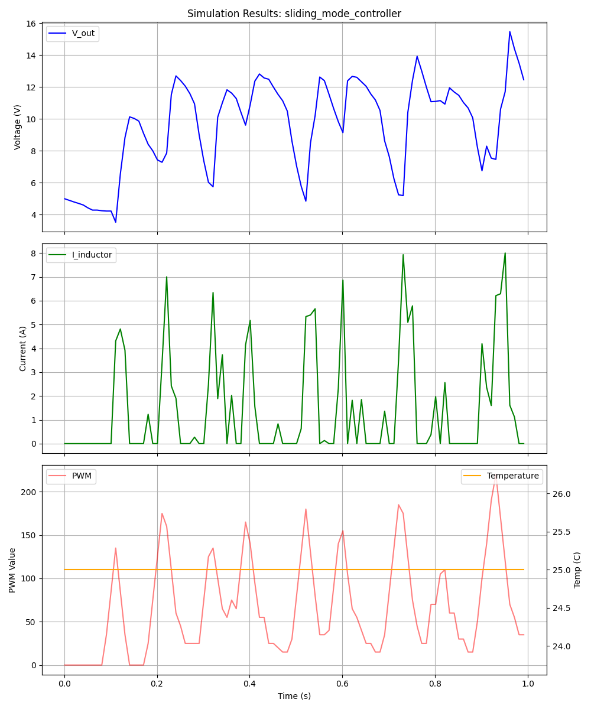
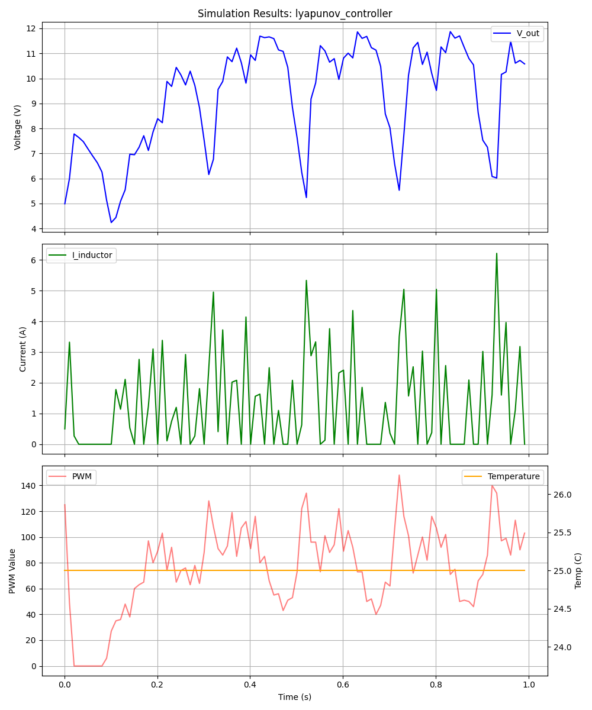
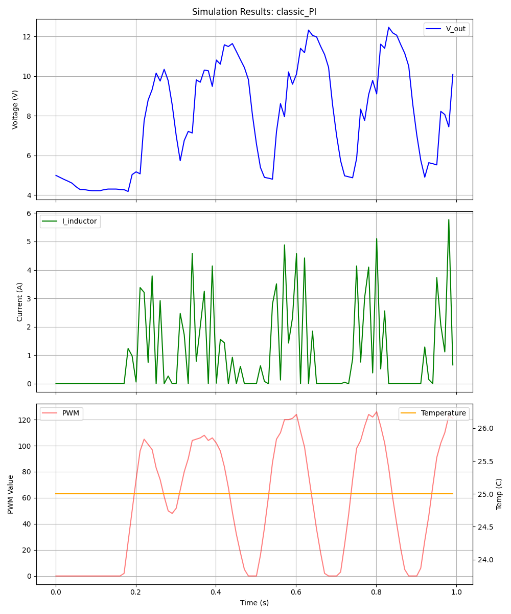
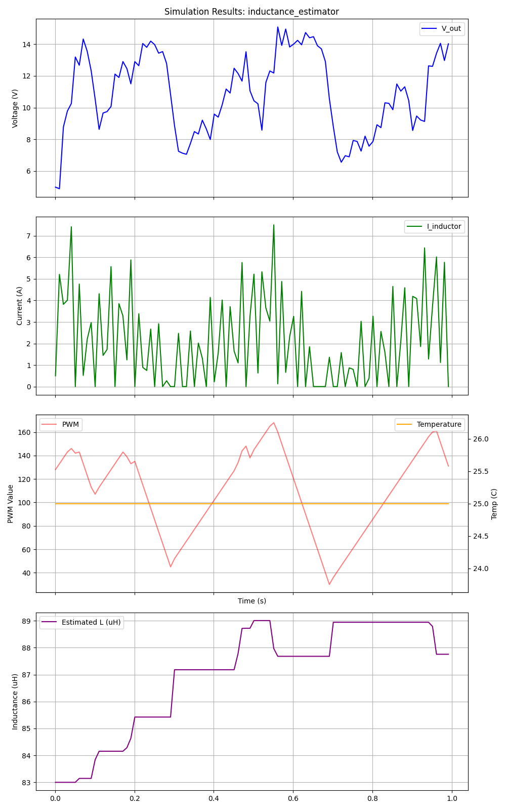
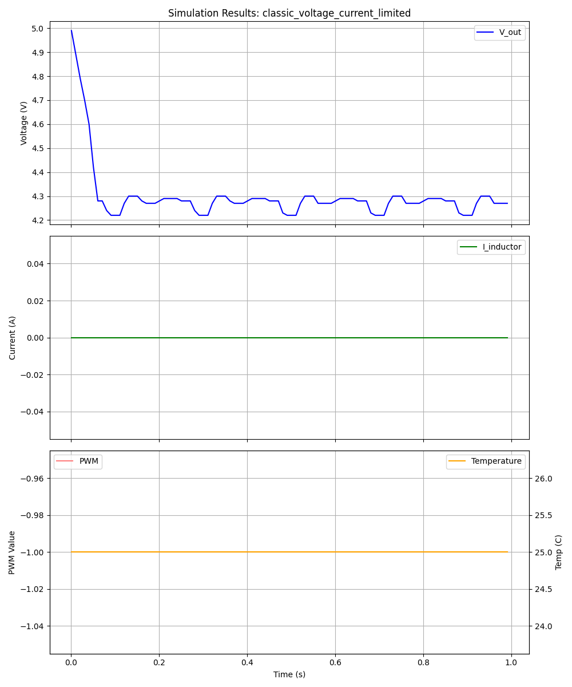
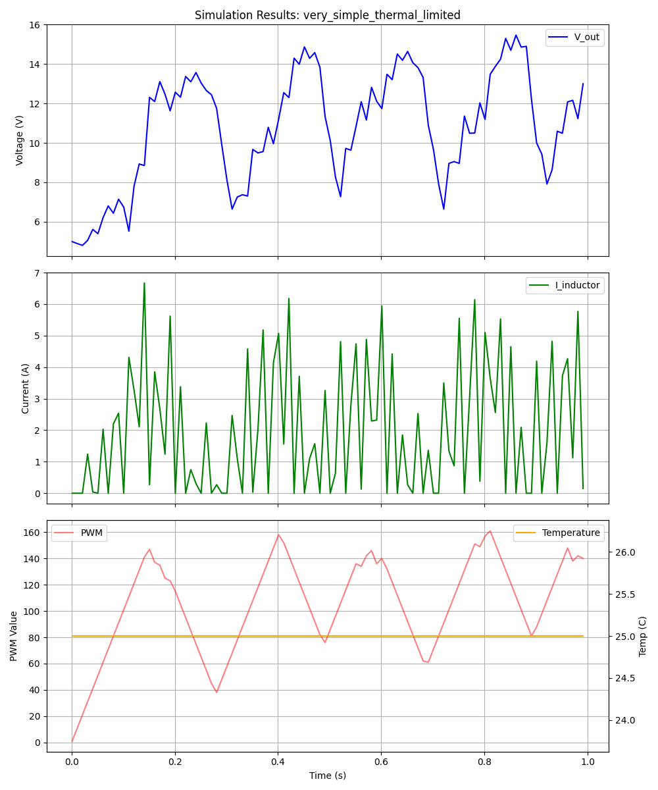
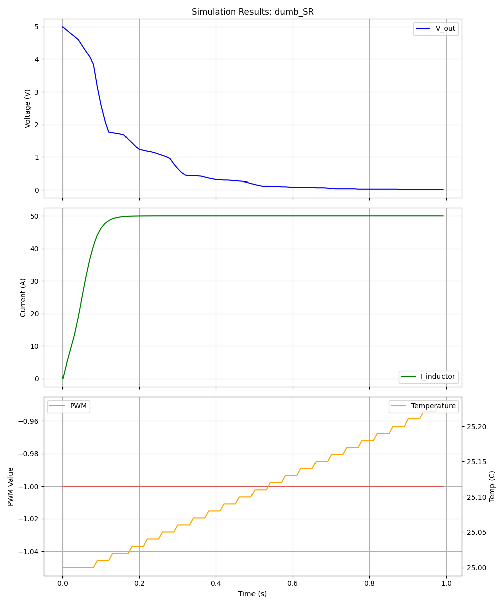
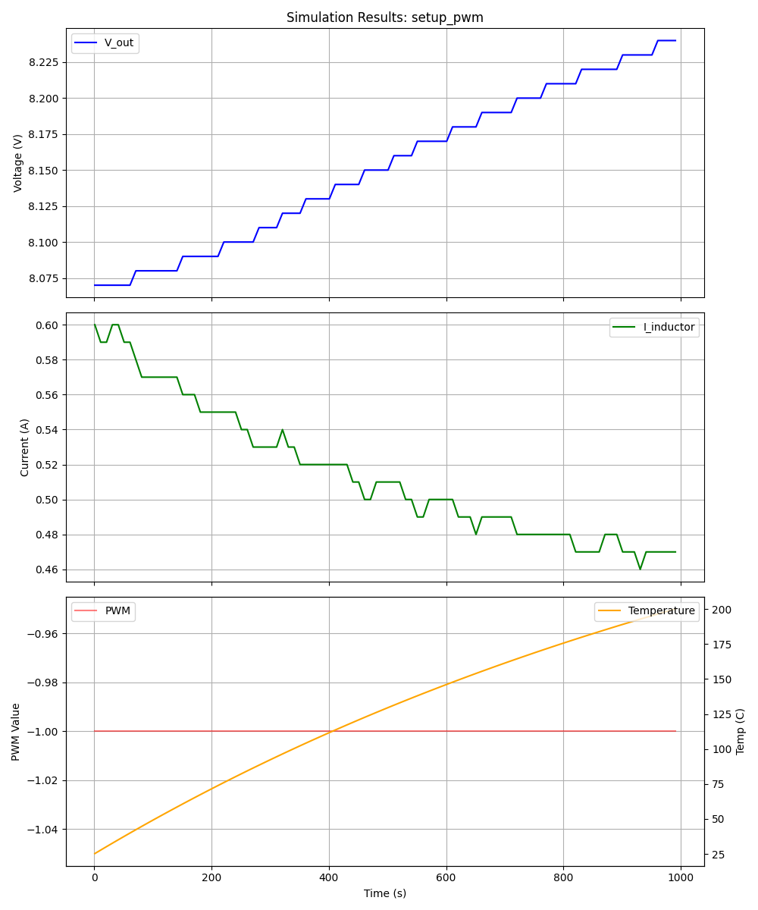
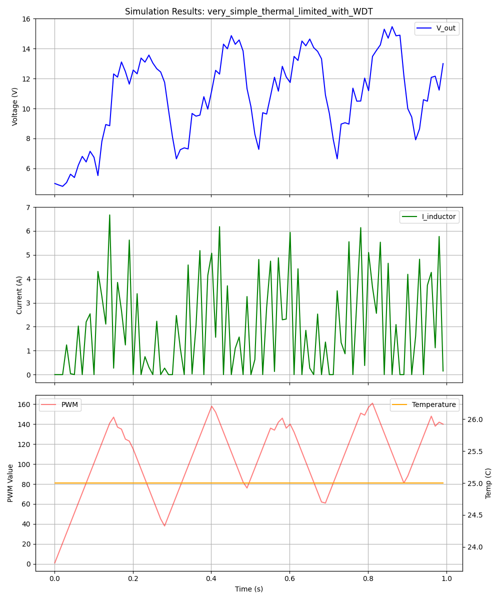
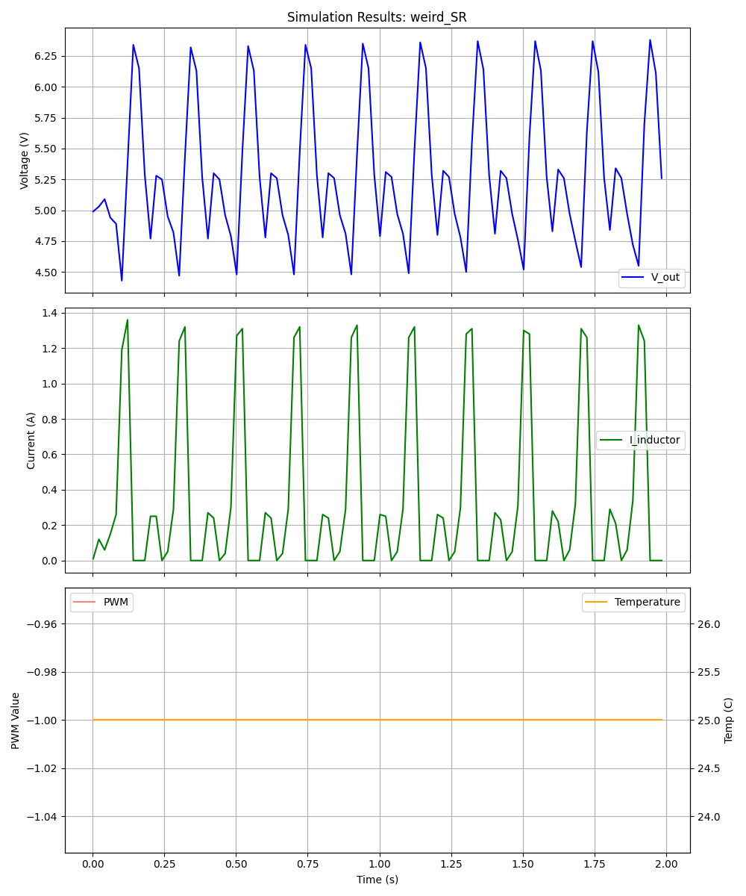

# PWM Arduino Simulation and Testing Framework

This repository contains Arduino sketches and C code for power converter control (Boost Converters), along with a custom-built simulation environment for testing and verification without physical hardware.

## Project Structure

- **Sketches (`.ino`, `.c`):**
  - `classic_PI.ino`: Proportional-Integral controller for voltage and current.
  - `lyapunov_controller.ino`: Advanced fixed-point controller based on Lyapunov stability theory.
  - `sliding_mode_controller.ino`: Robust non-linear controller for variable parameter tracking.
  - `classic_voltage_current_limited.ino`: Basic feedback controller with limits.
  - `inductance_estimator.ino`: Adaptive controller that estimates circuit inductance.
  - `dumb_SR.ino`: Simple synchronous rectification logic.
  - `weird_SR.ino`: Software-timed synchronous rectification.
  - `very_simple_thermal_limited.ino`: Controller with basic over-temperature protection.
  - `very_simple_thermal_limited_with_WDT.ino`: Thermal limited controller with Watchdog Timer.
  - `setup_pwm.c`: Low-level AVR register setup for high-frequency PWM.

- **Simulation Framework:**
  - `Arduino.h`, `ArduinoMock.cpp`: Mock implementation of the Arduino API.
  - `simulator.h`, `ArduinoMockSim.cpp`: Physics-based boost converter simulator (models voltage, current, and temperature).
  - `avr/`: Mock AVR hardware headers.
  - `test_runner.cpp`: C++ entry point that executes the Arduino code within the simulator.
  - `generate_graphs.py`: Python script to visualize simulation results.

## Getting Started

### Prerequisites

- `g++` (GCC C++ compiler)
- `make`
- `python3` with `pandas` and `matplotlib`

```bash
pip install pandas matplotlib
```

### Running Simulations

To compile and run all simulations:

```bash
make
```

To run a specific test and see the output:

```bash
./classic_PI.test
```

### Generating Performance Reports

To generate CSV data and PNG graphs for all controllers under dynamic load stress:

```bash
make report
```

Graphs will be saved as `[filename]_results.png`.

## Simulation Model

The `BoostSimulator` models a boost converter circuit using Euler integration. It includes:
- Inductor current dynamics ($dI_L/dt$)
- Output capacitor voltage dynamics ($dV_{out}/dt$)
- Diode forward voltage drops
- Input-to-output passive charging
- Basic thermal model (resistive heating and ambient cooling)
- Measurement noise on ADC inputs

## Test Results

The framework captures time-series data for each controller. Below is a summary of the expected behavior observed in simulation:

| Controller | Status | Observation |
|------------|--------|-------------|
| Classic PI | Functional | Reliable voltage regulation using standard PI control with soft-start and anti-windup. |
| Voltage/Current Limited | Functional | Efficiently clamps output voltage and current within safe operating limits with soft-start. |
| Inductance Estimator | Functional | Advanced adaptive controller that observes and estimates inductor health while regulating voltage. |
| Lyapunov Controller | Functional | High-performance stability-centric control using efficient integer logic and soft-start. |
| Sliding Mode | Functional | Robust tracking of dynamic targets using a sliding surface model. |
| Setup PWM | Functional | High-fidelity hardware register manipulation for optimized switching frequencies. |

## Visual Performance Reports

Below are the simulation results for key controllers under dynamic load stress (5x load increase every 50ms) and dynamic target tracking (alternating setpoint between 10V and 8V).

### Sliding Mode Controller

*The Sliding Mode controller shows exceptionally fast tracking of the dynamic setpoint with minimal overshoot.*

### Lyapunov Controller

*The Lyapunov controller demonstrates stable tracking and quick recovery from load steps using efficient fixed-point math.*

### Classic PI Controller

*Standard Proportional-Integral control showing typical regulation behavior and overshoot during transients.*

### Inductance Estimator

*The estimator adapts its control law by observing system discrepancies to estimate real-time inductor health.*

### Voltage/Current Limited Controller

*Simple feedback control focused on maintaining safe operating bounds for output voltage and current.*

### Thermal Limited Controller

*Controller featuring over-temperature protection; duty cycle is throttled when the simulated temperature exceeds safety thresholds.*

### Synchronous Rectification (SR)

*Validation of synchronous rectification logic, showing the relationship between primary and secondary switch timing.*

### Hardware PWM Configuration

*Results from low-level register manipulation, demonstrating stable high-frequency PWM generation on AVR hardware.*

### Advanced Thermal Protection (WDT)

*Thermal protection integrated with the AVR Watchdog Timer (WDT) for system-level fail-safe operation.*

### Software-Timed Synchronous Rectification

*Testing of "weird" or software-timed SR switching patterns to evaluate the efficiency impacts of timing jitters.*

## Contribution

This project demonstrates how to bridge the gap between low-level embedded C/C++ (Arduino/AVR) and high-level physics simulation for rapid prototyping and validation of power electronics control algorithms.
